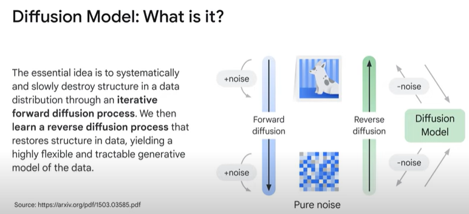
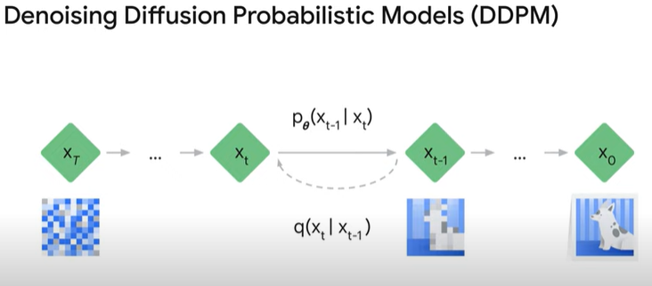
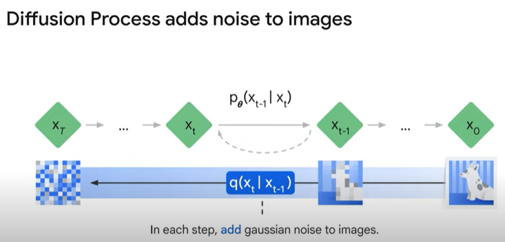
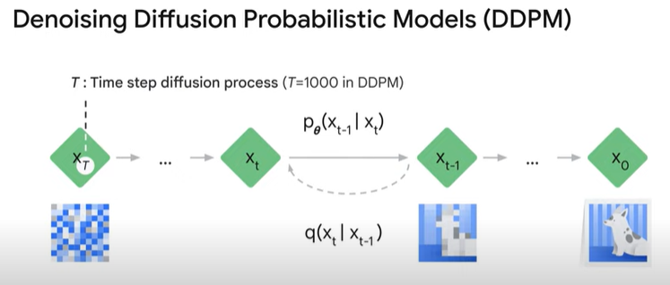
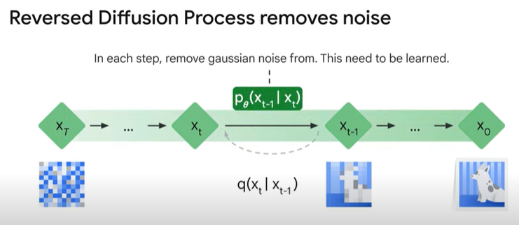
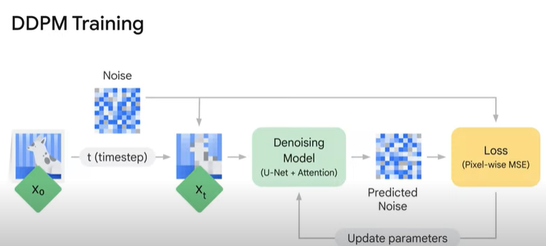
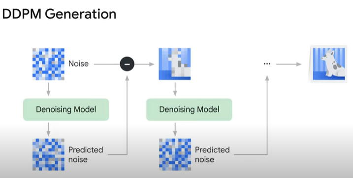
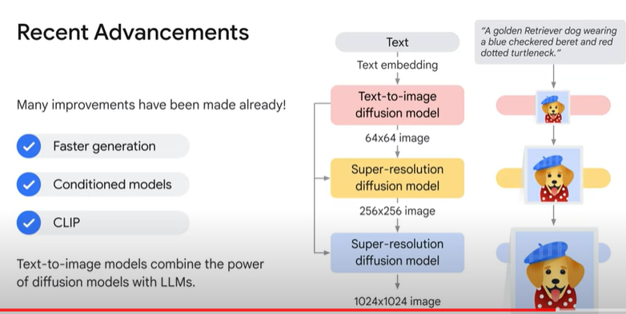

<h1>Introduction to Image Generation</h1>

* Introduction to diffusion models, a family of models that have shown promise in image generation. 

* Image generation has been approached through various models, including 
	* Variational Autoencoders (VAEs) - Encode images to a compressed size and then decode back to the original size while learning the distribution of the data 
	
	* Generative Adversarial Models (GANs) - Pit two NNs against each other, one NN the generator creates images and the other NN the discriminator predicts if the image is real or fake 
		
	* Autoregressive Models - generate images by treating an image as a sequence of pixels

* Diffusion models, inspired by thermodynamics, have gained popularity in recent years.

* Diffusion models: Use cases
	* unconditioned generation
		* Human face sysnthesis - e.g., generating images of specific things like faces
		* super resolution (enhancing low-quality images)
	* conditioned generation 
		* text-to-image, image inpainting, and text-guided image-to-image

* Diffusion models work by systematically and gradually destroying structure in a data distribution through an iterative forward diffusion process. 
* Noise is iteratively added to an image, and a reverse diffusion process is then learned to denoise the image, resulting in the generation of novel images. 

* The goal is to have the model learn to denoise and remove noise from images.

* The process of diffusion models, starting from an initial image and iteratively adding noise until reaching a state of pure noise. 

* Start with a large data set of images, but let's just take a single image. 
* On the right hand side, start this forward diffusion process, go from x0 the initial image to X1 the initial image with a little bit of noise added to it, can do this over and over again iteratively adding more and more noise to the initial image. 
* This distribution call Q and it only depends on the previous step

* if we do this over and over iteratively adding more noise (1000 times), should reach a state of Pure Noise.  so this point all structure in the initial image is completely gone, we're just looking at Pure Noise

* The challenging part is how do we go from a noisy image to a slightly less noisy image

* The challenging part is the reverse diffusion process, where a machine learning model is trained to predict the added noise and denoise the image.

* Visualize a single training step of the model, initial image X on the left, sample at a time step to create a noisy image, then send that through denoising model with the goal of predicting the noise so the output of the model is the predicted noise, but just added the noise to this image 

* Actually compare that, what is the difference between the model's predicted noise and the actual noise that we added

* Once the model is trained, it can be used to generate images. Starting with pure noise, the model can be applied iteratively, subtracting the predicted noise from the initial noise, resulting in the generation of new novel images.

* Advances in the field, combining diffusion models with large language models (LLMs) to create context-aware photorealistic images from text prompts. This combination of technologies has led to exciting developments in image generation.

Overall, diffusion models offer a flexible and tractable approach to image generation, and their integration with other techniques has expanded their potential for creating realistic and context-aware images.

Quiz

1. What is the goal of diffusion models?
	* [ ] To generate images by treating an image as a sequence of vectors
	* [x] To learn the latent structure of a dataset by modeling the way in which data points diffuse through the latent space
	* [ ] To pit two neural networks against each other
	* [ ] To encode images to a compressed size, then decode back to the original size

2. Which process involves a model learning to remove noise from images?
	* [ ] GANs
	* [ ] Forward diffusion
	* [ ] Sampling
	* [x] Reverse diffusion

3. What are some challenges of diffusion models?
	* [ ] They can generate images that are not realistic.
	* [ ] They can be computationally expensive to train.
	* [ ] They can be difficult to control.
	* [x] All of the above

4. What is the process of forward diffusion?
	* [ ] Start with a clean image and add noise randomly
	* [x] Start with a clean image and add noise iteratively
	* [ ] Start with a noisy image and remove noise iteratively
	* [ ] Start with a noisy image and remove noise randomly

5. What is the name of the model family that draws inspiration from physics and thermodynamics?
	* [ ] Generative adversarial networks
	* [x] Diffusion models
	* [ ] Variational autoencoders
	* [ ] Autoregressive models
