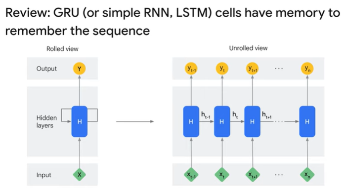

<h1>Create Image Captioning Models: Overview</h1>

* how to create a simple generative model called an Image Captioning Model. The model uses technologies like encoder-decoder, attention mechanism, and elements of the Transformer architecture.

* The dataset used for image captioning consists of pairs of images and corresponding text captions. The goal is to build a model that can generate text captions based on images.

* The model architecture is an encoder-decoder model. But in this case, encoder and decoder handle different modality of data, image and text. Pass images to encoder, and it extract information from the images, and create some feature vectors. And then the vectors are passed to the decoder which actually build caption ,by generating words one by one. 

* The code implementation involves using an image backbone, such as InceptionResNetV2, as the encoder. 

* This is the architecture of the decoder. It gets words one by one, mix the information of words and images which comes from the encoder output, and try to predict the next words. This decoder itself is an iterative operation.  we can eventually generate text. here we build Transformer-like architecture, although we still use RNN, or GRU.

* The decoder architecture is more complex and uses a combination of components, including word embeddings, a GRU (Gated Recurrent Unit) layer, an attention layer, an add layer, and layer normalization. The attention layer combines information from the text and image features to calculate attention scores.

* GRU is a variation of the recurrent neural network (call RNN). RNN takes input, and update its internal state, and generate output.

* The GRU output goes to Attention layer, which mixes the information of text and image.

* In TensorFlow Keras, use predefined layer, tf.keras.layers.Attention. use more Transformer-like architecture, tf.keras.layers.MultiHeadAttention

* Inside the attention layer, it pays attention to image feature, from text data. By doing so, it can calculate the attention score by mixing both information.

* this Attention layer takes two inputs, gru_output and encoder_output. Internally, gru_output is used as attention query and key, and encoder_output as value. 

* The last components are Add layer and Layer Normalization layer.  Add layer just adds two same shaped vectors. GRU output is passed to Attention layer, and to this Add layer directly. These two flows are eventually merged in this Add layer.

* This kind of architecture is called skip-connection, which has been a very popular deep NN design pattern since ResNet (called Residual connection). This skip connection is useful especially when you want to design a very deep NN. it is also used in the Transformer. 

* During the inference phase, which is used for generating captions for arbitrary images, there are three steps. First, the GRU initial state is generated, and a <start> token is created. Then, an input image is passed to the encoder to extract the feature vector. Finally, a for loop is used to call the decoder autoregressively, generating the captions word by word. The process continues until the <end> token is generated or a maximum caption length is reached.

* In the first step, we initialize two things: GRU state and <start> token. In this case, GRU state is simply initialized with 0 vectors. And we set <start> as the first input word for the decoder. 

* the word_to_index function used , just tokenize words to word tokens which is the standard text processing technique. 

* preprocess the input image a bit, and pass it to the encoder we trained. In terms of the image preprocessing, it reads and decodes jpeg, resizing it from any arbitrary resolution to specific resolution, and change the scale from 0 to 255, to 0 to 1. 

* decode for loop, call the decoder by passing 3 things. dec_input means decoder input, which should have a word token predicted in the previous iteration. if it is the first iteration,this would be the <start> token. gru_state is the current gru state. the decoder also outputs the updated gru_state. features, this is the image feature we extracted with encoder. 

* By passing them, we can get a actual next word prediction. This is a very simple text geration model from images, but very similar in very large language generation models, like Google Bard. 

* They basically predict the next word autoregressively one by one based on some infomation, and learned knowledge embeded in a huge number of parameters.

* A high-level overview of the code and the steps involved in training and inference for the image captioning model.

Quiz

1. What is the goal of the image captioning task?
	* [ ] To write different creative text formats, like poems, code, scripts, musical pieces, email, letters, etc.
	* [ ] To answer your questions in an informative way, even if they are open ended, challenging, or strange.
	* [x] To generate text captions for images
	* [ ] To translate text from one language to another

2. What is the name of the dataset the video uses to train the encoder-decoder model?
	* [ ] MNIST dataset
	* [ ] Fashion-MNIST dataset
	* [x] COCO dataset
	* [ ] ImageNet dataset

3. What is the purpose of the attention mechanism in an encoder-decoder model?
	* [ ] To generate text captions for the image.
	* [ ] To translate text from one language to another.
	* [x] To allow the decoder to focus on specific parts of the image when generating text captions.
	* [ ] To extract information from the image.

4. What is the purpose of the decoder in an encoder-decoder model?
	* [ ] To learn the relationship between the input and output data
	* [ ] To store the output data
	* [x] To generate output data from the information extracted by the encoder
	* [ ] To extract information from the input data

5. What is the purpose of the encoder in an encoder-decoder model?
	* [ ] To translate text from one language to another.
	* [ ] To answer your questions in an informative way, even if they are open ended, challenging, or strange.
	* [x] To extract information from the image.
	* [ ] To generate text captions for the image.

6. What is the name of the model that is used to generate text captions for images?
	* [ ] Image classification model
	* [ ] Image generation model
	* [x] Encoder-decoder model
	* [ ] Bidirectional Encoder Representations from Transformers (BERT) model
