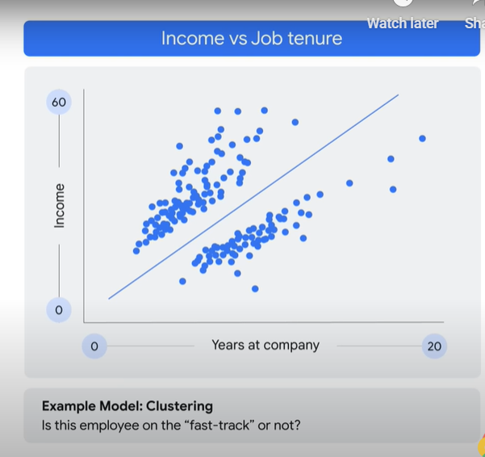

<h1>Introduction to enerative AI</h1>

* Learn to define generative AI, explain how generative AI works, describe generative AI model types and applications.

* <b><u>Generative AI</u></b> is a type of AI technology that can produce various types of content, including text, imagery, audio, and synthetic data.

* What is <b>AI</b>? What is the difference between AI and ML? 
	* AI is a discipline, like physics for example.
	* AI is a branch of computer science that deals with the creation of intelligence agents, which are systems that can reason, learn and act autonomously.
	* AI has to do with the theory and methods to build machines that think and act like humans.

* <b>ML</b>, which is a subfield of AI.
	* It is a program or system that trains a model from input data.
	* That trained model can make useful predictions from new or never before seen data drawn from the same one used to train the model.
	* ML gives computers the ability to learn without explicit programming.

* 2 most common ML models, <b>1) unsupervised and 2) supervised ML models</b>.
	* The key difference between is, with supervised models, we have labels.
	* Labeled data is data that comes with a tag like a name, a type or a number.
	* Unlabeled data is data that comes with no tag.

* <b>A supervised model</b> example
	* You have historical data of the bill amount and how much different people tipped based on order type and whether it was picked up or delivered.
	* The model learns from past examples to predict future values, in this case tips.
	* So here the model uses the total bill amount to predict the future tip amount based on whether an order was picked up or delivered.

* <b>An unsupervised model</b> example
	* Look at 10 year, an income and then group or cluster employees to see whether someone is on the fast track.
	* Unsupervised problems are all about discovery, about looking at the raw data and seeing if it naturally falls into groups.

	
* Understanding these concepts are the foundation for your understanding of generative AI
	* Testing data values or x are input into the model.
	* The model outputs a prediction and compares that prediction to the training data used to train the model.
	* If the predicted test data values and actual training data values are far apart, that's called error.
	* And the model tries to reduce this error until the predicted and actual values are closer together. This is a <b><u>classic optimization problem</u></b>.

* <b>Deep learning</b> is a subset of ML methods. DL uses artificial NN, allowing them to process more complex patterns than ML.

* Artificial NN are inspired by the human brain. 
	* Made up of many interconnected layers of nodes or neurons that can learn to perform tasks by processing data and making predictions.
	* NN can use both labeled and unlabeled data.

* <b>Semi-supervised learning</b>
	* a NN is trained on a small amount of labeled data and a large amount of unlabeled data.
	* The labeled data helps the NN to learn the basic concepts of the task 
	* The unlabeled data helps the NN to generalize to new examples.
	
* <b><u>Generative AI</u></b> is a subset of deep learning, which means it uses artificial NN, can process both labeled and unlabeled data using supervised, unsupervised, and semi-supervised methods.

* <b>Large language models</b> are also a subset of deep learning.

* DL or ML models in general, can be divided into <b>two types, generative and discriminative</b>.
	* <b>A discriminative model</b> used to classify or predict labels for data points.
		* Discriminative models are typically trained on a data set of labeled data points.
		* Learns the relationship between the features of the data points and the labels.
		* Once a discriminative model is trained, it can be used to predict the label for new data points.

	
	* <b>A generative model</b> generates new data instances based on a learned probability distribution of existing data. 
		
	* The discriminative model learns the conditional probability distribution or the probability of y (output), given x (input), that this is a dog and classifies it as a dog and not a cat.
	* The generative model learns the joint probability distribution or the probability of x and y and predicts the conditional probability that this is a dog and can then generate a picture of a dog.
	
	* So to summarize, generative models can generate new data instances while discriminative models discriminate between different kinds of data instances.
	

* a traditional ML model which attempts to learn the relationship between the data and the label, or what you want to predict.
* a generative AI model which attempts to learn patterns on content so that it can generate new content.

 
* It is not gen AI when the output or y or label is a number or a class, discrete, class or a probability.
* It is gen AI when the output is natural language, like speech, text, an image or audio, for example.

* If the y is the number, like predicted sales, it is not gen AI.
* If y is a sentence, like define sales, it is generative

* To summarize at a high level, the traditional, classical supervised and unsupervised learning process takes training code and label data to build a model.
* Depending on the use case or problem, the model can give you a prediction or classify or cluster.

* The gen AI process can take training code, label data, and unlabeled data of all data types and build a foundation model.
* The foundation model can then generate new content. For example, text, code, images, audio, video, etc.

* In traditional programming, hard code the rules for distinguishing a cat, the type: animal, legs: 4, ears: 2, fur: yes, likes: yarn, catnip.

* In NN, give the network pictures of cats and dogs, and ask is this a cat and it would predict a cat.

* In generative wave, users can generate our own content, whether it be text, images, audio, video, etc. - For example models like <b>PaLM (Pathways Language Model), LAMBDA (Language Model for Dialogue Applications)</b>, ingest very large data from the multiple sources across the internet and build foundation language models. We can use, simply by asking a question, whether typing it into a prompt or verbally talking into the prompt itself.
* So when you ask it what's a cat, it can give you everything it has learned about a cat.

* What is <b><u>Generative AI</u></b>?
	* GenAI is a type of AI that creates new content based on what it has learned from existing content.
	* The process of learning from existing content is called training and results in the creation of a statistical model.
	* when given a prompt, GenAI uses this stattistical model to predict what an expected response might be-and this generates new content.
	
	
* Generative Models 
	* It learns the underlying structure of the data and can then generate new samples that are similar to the data it was trained on.
	* A generative language model can take what it has learned from the examples it's been shown and create something entirely new based on that information.
	* Large language models are one type of generative AI, since they generate novel combinations of text in the form of natural sounding language.
	* A generative image model takes an image as input and can output text, another image, or video.
		* 
		* For example, under the output text, you can get visual question answering, while under output image, an image completion is generated. And under output video, animation is generated.
	* 
	* A generative language model takes text as input and can output more text, an image, audio, or decisions. 
		* For example, under the output text, question answering is generated. And under output image, a video is generated.
		
* Generative language models learn about patterns and language through training data, then, given some text, they predict what comes next.
	* Thus generative language models are pattern matching systems. They learn about patterns based on the data you provide.
	
	* Here is an example. 
		* Based on things it's learned from its training data, it offers predictions of how to complete this sentence,
		* "I'm making a sandwich with peanut butter and jelly."
		* Here is the same example using Bard,
		* 	
	* 	

	
* <b>How it works</b>
	* The power of generative AI comes from the use of transformers.
	* Transformers produced a 2018 revolution in natural language processing.
	* At a high level, a transformer model consists of an encoder and decoder.
	* The encoder encodes the input sequence and passes it to the decoder, which learns how to decode the representation for a relevant task.
	* In transformers, hallucinations are words or phrases that are generated by the model that are often nonsensical or grammatically incorrect.

	
* <b>Hallucinations</b> can be caused by a number of factors, including the model is not trained on enough data, or the model is trained on noisy or dirty data, or the model is not given enough context, or the model is not given enough constraints.
	* Hallucinations can be a problem for transformers because they can make the output text difficult to understand. 
	* They can also make the model more likely to generate incorrect or misleading information.

* <b>Prompt Design</b> 
	* A prompt is a short piece of text that is given to the large language model as input.
	* And it can be used to control the output of the model in a variety of ways.
	* Prompt design is the process of creating a prompt that will generate the desired output from a large language model.

* <b>Model Types</b>
	* <b>Text-to-text models</b> take a natural language input and produces a text output. These models are trained to learn the mapping between a pair of text (e.g. translation from one language to another).
		* Applications - Generation, Classification, Summarization, Translation, (Re)Search, Extraction, Clustering, Content editing / rewriting
	* <b>Text-to-image models</b> are trained on a large set of images, each captioned with a short text description. Diffusion is one method used to achieve this.
		* Applications - Image generation, Image editing
	* <b>Text-to-video models</b> aim to generate a video representation from text input. The input text can be anything from a single sentence to a full script. And the output is a video that corresponds to the input text.
	* <b>text-to-3D models</b> generate three dimensional objects that correspond to a user's text description. 
		* For example, this can be used in games or other 3D worlds.
		* Applications - video generation, video editing, Game assests
	* <b>Text-to-task models</b> are trained to perform a defined task or action based on text input. This task can be a wide range of actions such as answering a question, performing a search, making a prediction, or taking some sort of action. 
		* For example, a text-to-task model could be trained to navigate a web UI or make changes to a doc through the GUI.
		* Applications - Software agents, Virtual assistants, Automation

* <b>Foundation Model</b> 
	* A foundation model is a large AI model pre-trained on a vast quantity of data designed to be adapted or fine tuned to a wide range of downstream tasks, such as sentiment analysis, image captioning, and object recognition.
	* Foundation models have the potential to revolutionize many industries, including health care, finance, and customer service.
	* They can be used to detect fraud and provide personalized customer support.

* <b>Vertex AI</b> offers a model garden that includes foundation models. 
	* The language foundation models include PaLM API for chat and text.
	* The vision foundation models includes stable diffusion, which has been shown to be effective at generating high quality images from text descriptions.

* Use Case
	* need to gather sentiments about how your customers are feeling about your product or service.
		* You can use the sentiment analysis task model for just that purpose.
	* needed to perform occupancy analytics? There is a task model for your use case.

* <b><u>Generative AI</u></b> Application Landscape 
	* code generation example  input a code file conversion problem, converting from Python to JSON.
	* 
	* 
	* 
	* To summarize, Bart code generation can help you debug your lines of source code, explain your code to you line by line, translate code from one language to another, and generate documentation and tutorials for source code.
	
	
* <b><u>Generative AI</u></b> Studio 
	* Generative AI Studio lets you quickly explore and customize GenAI models that you can leverage in your applications on Google Cloud.
	* Generative AI Studio helps developers create and deploy GenAI models by providing a variety of tools and resources that make it easy to get started.
	* For example, there's a library of pre-trained models.There is a tool for fine tuning models. There is a tool for deploying models to production. And there is a community forum for developers to share ideas and collaborate.
	
* <b><u>Generative AI</u></b> App Builder
	* Generative AI App Builder lets you create gen AI apps without having to write any code.
	* Gen AI App Builder has a drag and drop interface that makes it easy to design and build apps.
	* It has a visual editor that makes it easy to create and edit app content.
	* It has a built-in search engine that allows users to search for information within the app.
	*  And it has a conversational AI Engine that helps users to interact with the app using natural language.
	* You can create your own digital assistants, custom search engines, knowledge bases, training applications, and much more.

	
* PaLM API  lets you test and experiment with Google's large language models and gen AI tools.
	* To make prototyping quick and more accessible, developers can integrate PaLM API with Maker suite and use it to access the API using a graphical user interface.
	* The suite includes a number of different tools such as a model training tool, a model deployment tool, and a model monitoring tool.
		* The model training tool helps developers train ML models on their data using different algorithms.
		* The model deployment tool helps developers deploy ML models to production with a number of different deployment options.
		* The model monitoring tool helps developers monitor the performance of their ML models in production using a dashboard and a number of different metrics.

Quiz

1. What are foundation models in Generative AI?.
	* [ ] A foundation model is a small AI model pretrained on a small quantity of data that was "designed to be adapted” (or * fine-tuned) to a wide range of downstream tasks, such as sentiment analysis, image captioning, and object recognition.
	* [ ] A foundation model is a large AI model pretrained on a vast quantity of data that was "designed to be adapted” (or fine-tuned) to a wide range of upstream tasks, such as sentiment analysis, image captioning, and object recognition.
	* [x] A foundation model is a large AI model pretrained on a vast quantity of data that was "designed to be adapted” (or fine-tuned) to a wide range of downstream tasks, such as sentiment analysis, image captioning, and object recognition.
	* [ ] A foundation model is a large AI model post-trained on a vast quantity of data that was "designed to be adapted” (or fine-tuned) to a wide range of downstream tasks, such as sentiment analysis, image captioning, and object recognition.
	* [ ] A foundation model is a large AI model both post and pre-trained on a vast quantity of data that was "designed to be adapted” (or fine-tuned) to a wide range of downstream tasks, such as sentiment analysis, image captioning, and object recognition.

2. Hallucinations are words or phrases that are generated by the model that are often nonsensical or grammatically incorrect. What are some factors that can cause hallucinations? Select three options.
	* [ ] The model is trained on too much data.
	* [x] The model is not trained on enough data
	* [x] The model is not given enough context.
	* [x] The model is trained on noisy or dirty data.

3. What is an example of both a generative AI model and a discriminative AI model?
	* [x] A generative AI model could be trained on a dataset of images of cats and then used to generate new images of cats. A discriminative AI model could be trained on a dataset of images of cats and dogs and then used to classify new images as either cats or dogs.
	* [ ] A generative AI model does not need to be trained on a dataset of images of cats and then used to generate new images of cats, because the images were already generated by using AI. A discriminative AI model could be trained on a dataset of images of cats and dogs and then used to classify new images as either cats or dogs.
	* [ ] A generative AI model could be trained on a dataset of images of cats and then used to cluster images of cats. A discriminative AI model could be trained on a dataset of images of cats and dogs and then used to predict as either cats or dogs.
	* [ ] A generative AI model could be trained on a dataset of images of cats and then used to classify new images of cats. A discriminative AI model could be trained on a dataset of images of cats and dogs and then used to predict new images as either cats or dogs.
	* [ ] A generative AI model could be trained on a dataset of images of cats and then used to cluster images of cats. A discriminative AI model could be trained on a dataset of images of cats and dogs and then used to predict as either cats or dogs.

4. What is Generative AI?:
	* [x] Generative AI is a type of artificial intelligence (AI) that can create new content, such as text, images, audio, and video. It does this by learning from existing data and then using that knowledge to generate new and unique outputs.
	* [ ] Generative AI is a type of artificial intelligence (AI) that can create new content, such as discrete numbers, classes, and probabilities. It does this by learning from existing data and then using that knowledge to generate new and unique outputs.
	* [ ] Generative AI is a type of artificial intelligence (AI) that can only create new content, such as text, images, audio, and video by learning from new data and then using that knowledge to predict a discrete, supervised learning output.
	* [ ] Generative AI is a type of artificial intelligence (AI) that can only create new content, such as text, images, audio, and video by learning from new data and then using that knowledge to predict a classification output.

5. What is a prompt?
	- [ ] A prompt is a short piece of text that is given to the small language model (SLM) as input, and it can be used to control the output of the model in many ways.
	- [x] A prompt is a short piece of text that is given to the large language model as input, and it can be used to control the output of the model in many ways.
	- [ ] A prompt is a long piece of text that is given to the large language model as input, and it cannot be used to control the output of the model.
	- [ ] A prompt is a short piece of text that is given to the large language model as input, and it can be used to control the input of the model in many ways.