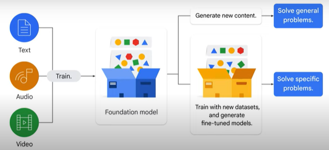
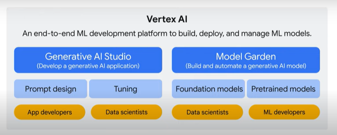
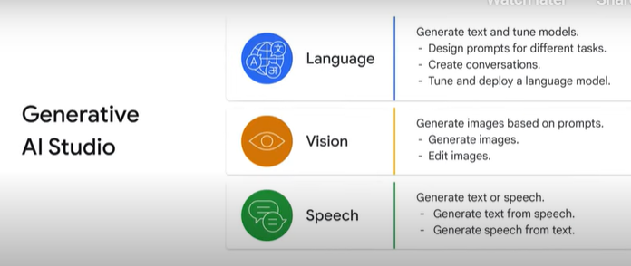
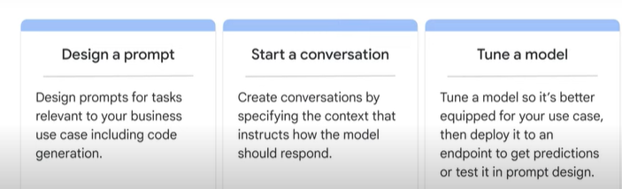
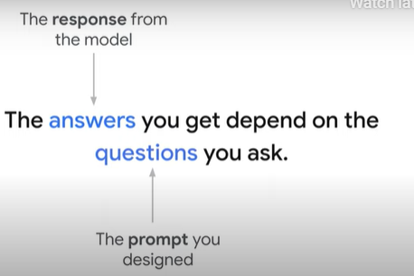
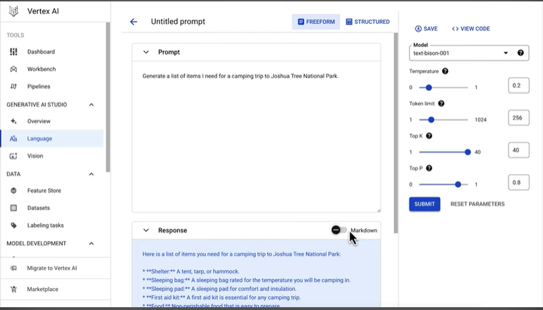

# Introduction to Generative AI Studio

* What is Generative AI? - It is a type of AI that generates content for you. 

* What kind of content? - The generated content can be multi-modal, including text, images, audio, and video.

* When given a prompt or a request - Generative AI can help you achieve various tasks, such as document summarization, information extraction, code generation, marketing campaign creation, virtual assistance, and call center bot.

* How does AI generate new content? - It learns from a massive amount of existing content (text, audio and video), called training, which results in the creation of a “foundation model.”
    1. An large language model (LLM), which powers chat bots like Bard, is a typical example of a foundation model.
    2. The foundation model can then be used to generate content and solve general problems, such as content extraction and document summarization. 
    3. It can also be trained further with new datasets in your field to solve specific problems, such as financial model generation and healthcare consulting. This results in the creation of a new model that is tailored to your specific needs. 

* How can you use the foundation model to power your applications, and how can you further train, or tune, the foundation model to solve a problem in your specific field?
    1. GCP provides several generative AI tools with or without an AI and machine learning background.
    2. Vertex AI

* Vertex AI - is an end-to-end ML development platform on GC that helps you build, deploy, and manage ML models. 
    1. An app developer or data scientist want to build an application, use Generative AI Studio to quickly prototype and customize generative AI models with no code or low code. 
    2. Data scientist or ML developer who wants to build and automate a generative AI model, you can start from Model Garden.
    3. Model Garden lets you discover and interact with Google’s foundation and third-party open source models and has built-in MLOps tools to automate the ML pipeline.

# Generative AI Studio
* It supports language, vision, and speech. 

* Language in Generative AI Studio.
    1. Experimenting with LLMs -> click on NEW PROMPT.
    2. In the world of Generative AI, a prompt is just a fancy name for the input text that you feed to your model. 
    
    3. feed your desired input text like questions and  instructions to the model.
    4. The model will then provide a response based on how you structured your prompt, therefore, the answers you get depend on the questions you ask. 
    5. The process of figuring out and designing the best input text to get the desired response back from the model is called Prompt Design, which often involves a lot of experimentation.
    
    6. Example with a <u>free-form prompt</u> - the model outputs a useful list of items, this approach of writing a single command so that the LLM can adopt a certain behavior, is called <u>zero shot prompting</u>. 
    8. Generally, there are 3 methods that you can use to shape the model's response in a way that you desire. Zero-shot prompting - is a method where the LLM is given no additional data on the specific
04:35
task that it is being asked to perform. Instead, it is only given a prompt that describes the task. For example, if you want the LLM to answer a question, you just prompt "what is prompt
04:46
design?". One-shot prompting - is a method where the LLM is given a single example of the task that it is being asked to perform. For example, if you want the LLM to write a poem, you might provide a single example
04:58
poem. and Few-shot prompting - is a method where the LLM is given a small number of examples of the task that it is being asked to perform. For example, if you want the LLM to write a news article, you might give it a few news
05:11
articles to read. You can use the structured mode to design the few-shot prompting by providing a context and additional examples for the model to learn from. The structured prompt contains a few different components:
05:24
First we have the context, which instructs how the model should respond. You can specify words the model can or cannot use, topics to focus on or avoid, or a particular
05:33
response format. And the context applies each time you send a request to the model. Let’s say we want to use an LLM to answer questions based on some background text.
05:42
In this case, a passage that describes changes in rainforest vegetation in the Amazon. We can paste in the background text as the context. Then, we add some examples of questions that could be answered from this passage
05:55
Like what does LGM stand for? Or what did the analysis from the sediment deposits indicate? We’ll need to add in the corresponding answers to these questions, to demonstrate how we
06:05
want the model to respond. Then, we can test out the prompt we’ve designed by sending a new question as input. And there you go, you’ve prototyped a q&a system based on background text in just a
06:14
few minutes! Please note a few best practices around prompt design. Be concise Be specific and well-defined Ask one task at a time Turn generative tasks into classification tasks. For example, instead of asking what programming language to learn, ask if Python, Java, or
06:33
C is a better fit for a beginner in programming. and Improve response quality by including examples Adding instructions and a few examples tends to yield good results however there’s currently
06:44
no one best way to write a prompt. You may need to experiment with different structures, formats, and examples to see what works best for your use case. For more information about prompt design, please check text prompt design in the reading
06:57
list. So if you designed a prompt that you think is working pretty well, you can save it and return to it later. Your saved prompt will be visible in the prompt gallery, which is a curated collection of
07:07
sample prompts that show how generative AI models can work for a variety of use cases. Finally, in addition to testing different prompts and prompt structures, there are a few model parameters you can experiment with to try to improve the quality of responses.
07:22
First, there are different models you can choose from. Each model is tuned to perform well on specific tasks. You can also specify the temperature, top P, and top K. These parameters all adjust
07:34
the randomness of responses by controlling how the output tokens are selected. When you send a prompt to the model, it produces an array of probabilities over the words that
07:43
could come next. And from this array, we need some strategy to decide what to return. A simple strategy might be to select the most likely word at every timestep.
07:52
But this method can result in uninteresting and sometimes repetitive answers. On the contrary, if you randomly sample over the distribution returned by the model, you might get some unlikely responses.
08:04
By controlling the degree of randomness, you can get more unexpected, and some might say creative, responses. Back to the model parameters, temperature is a number used to tune the degree of randomness.
08:15
Low temperature: Means to select the words that are highly possible and more predictable. In this case, those are flowers and the other words that are located at the beginning of
08:23
the list. This setting is generally better for tasks like q&a and summarization where you expect a more “predictable” answer with less variation. … High temperature: Means to select the words that have low possibility and are more unusual.
08:37
In this case, those are bugs and the other words that that are located at the end of the list. This setting is good if you want to generate more “creative” or unexpected content.
08:47
In addition to adjusting the temperature, top K lets the model randomly return a word from the top K number of words in terms of possibility. For example, top 2 means you get a random word from the top 2 possible words including
09:00
flowers and trees. This approach allows the other high-scoring word a chance of being selected. However, if the probability distribution of the words is highly skewed and you have one
09:11
word that is very likely and everything else is very unlikely, this approach can result in some strange responses. The difficulty of selecting the best top-k value, leads to another popular approach that
09:23
dynamically sets the size of the shortlist of words. Top P allows the model to randomly return a word from the top P probability of words. With top P, you choose from a set of words with the sum of the likelihoods not exceeding
09:38
P. For example, p of 0.75 means you sample from a set of words that have a cumulative probability greater than 0.75. In this case, it includes three words: flowers, trees, and herbs.
09:53
This way, the size of the set of words can dynamically increase and decrease according to the probability distribution of the next word on the list. In sum, Generative AI Studio provides a few model parameters for you to play with such
10:06
as the model, temperature, top K, and top P. Note that, you are not required to adjust them constantly, especially top k and top p. Now let’s look at the second feature, which creates conversations.
10:19
First, you need to specify the conversation context. Context instructs how the model should respond. For example, specifying words the model can or cannot use, topics to focus on or avoid,
10:32
or response format. Context applies each time you send a request to the model. For a simple example, you can define a scenario and tell the AI how to respond to help desk
10:42
queries. Your name is Roy. You are a support technician of an IT department. You only respond with "Have you tried turning it off and on again?" to any queries.
10:52
You can tune the parameters on the right, the same as you do when designing the prompt. To to see how it works, you can type My computer is slow in the chat box and press enter.
11:02
The AI responds: Have you tried turning it off and on again? Exactly as you told the AI to do. The cool thing is that Google provides the APIs and SDKs to help you build your own application.
11:15
You can simply click view code. First, you need to download the Vertex AI SDKs that fit your programming language, like Python and Curl. SDK stands for software design kits.
11:26
They implement the functions and do the job for you. You can use them like you call libraries from the code. You then follow the sample code and the API, and insert the code into your application.
11:38
Now let’s look at the third feature, tune a language model. If you’ve been prototyping with large language models, you might be wondering if there’s a way you can improve the quality of responses beyond just prompt design.
11:48
So let’s learn how to tune a large language model and how to launch a tuning job from Generative AI Studio. As a quick recap, the prompt is your text input that you pass to the model.
11:59
Your prompt might look like an instruction… And maybe you add some examples… Then you send this text to the model so that it adopts the behavior that you want.
12:09
Prompt design allows for fast experimentation and customization. And because you’re not writing any complicated code, you don’t need to be an ML expert to get started. But producing prompts can be tricky.
12:20
Small changes in wording or word order can affect the model results in ways that aren’t totally predictable. And you can’t really fit all that many examples into a prompt.
12:29
Even when you do discover a good prompt for your use case, you might notice the quality of model responses isn’t totally consistent. One thing we can do to alleviate these issues is to tune the model.
12:40
So what’s tuning? Well, one version you might be familiar with is fine-tuning. In this scenario, we take a model that was pretrained on a generic dataset. We make a copy of this model.
12:51
Then, using those learned weights as a starting point, we re-train the model on a new domain-specific dataset. This technique has been pretty effective for lots of different use cases.
13:01
But when we try to fine tune LLMs, we run into some challenges. LLMs are, as the name suggests, large. So updating every weight can take a long training job.
13:12
Compound all of that computation with the hassle and cost of now having to serve this giant model… And as a result, fine-tuning a large language model might not be the best option for you.
13:21
But there’s an innovative approach to tuning called parameter-efficient tuning. This is a super exciting research area that aims to reduce the challenges of fine-tuning LLMs, by only training a subset of parameters.
13:34
These parameters might be a subset of the existing model parameters. Or they could be an entirely new set of parameters. For example, maybe you add on some additional layers to the model or an extra embedding
13:45
to the prompt. If you want to learn more about parameter-efficient tuning and some of the different methods, a summary paper is included in the reading list of this course.
13:53
But if you just want to get to building, then let's move to Generative AI Studio and see how to start a tuning job. From the language section of Generative AI Studio,
14:02
Select TUNING. To create a tuned model, we provide a name. Then point to the local or Cloud Storage location of your training data. Parameter efficient tuning is ideally suited for scenarios where you have "modest" amounts
14:14
of training data, say hundreds or maybe thousands of training examples. Your training data should be structured as a supervised training dataset in a text to text format. Each record or row in the data will contain the input text, in other words, the prompt,
14:29
which is followed by the expected output of the model. This means that the model can be tuned for a task that can be modeled as a text-to-text problem. After specifying the path to your dataset, you can start the tuning job and monitor the
14:42
status in the Google Cloud console. When the tuning job completes, you’ll see the tuned model in the Vertex AI Model Registry and you can deploy it to an endpoint for serving, or you can test it in the Generative AI Studio.
14:56
In this course, you learned what Generative AI is and the tools provided by Google Cloud to empower your project with Generative AI capabilities. Specifically, you focused on Generative AI Studio, where you can use genAI in your application
15:10
by quickly prototyping and customizing generative AI models. You learned that Generative AI Studio supports three options: language, vision, and speech. You then walked through the three major features in Language: design and test prompt, create
15:24
conversations, and tune models. This was a short lesson introducing Generative AI studio on Vertex AI. For more information about natural language processing and different types of language models like decoder-encoder, transformer, and LLM, please check the course titled Natural
15:42
Language Processing on Google Cloud listed in the reading list. Now it’s time to play with Generative AI Studio in a hands-on lab, where you: Design and test prompts in both free-form and structured modes.
15:54
Create conversations. And explore the prompt gallery. By the end of this lab, you will be able to use the capabilities of Generative AI Studio that we’ve discussed in this course.
16:04
Have fun exploring!
