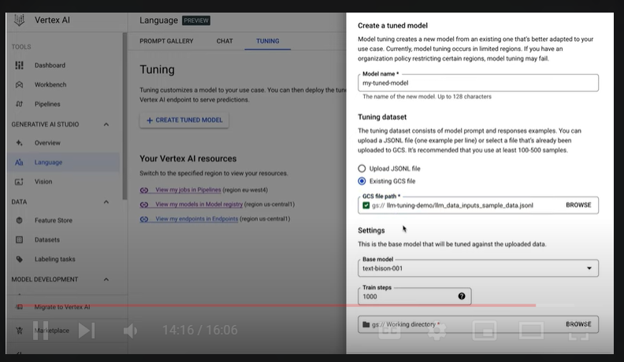

# Introduction to Generative AI Studio

* <ins>What is Generative AI?</ins> - It is a type of AI that generates content for you. 

* <ins>What kind of content?</ins> - The generated content can be multi-modal, including text, images, audio, and video.

* <ins>When given a prompt or a request</ins> - Generative AI can help you achieve various tasks, such as document summarization, information extraction, code generation, marketing campaign creation, virtual assistance, and call center bot.

* <ins>How does AI generate new content?</ins> - It learns from a massive amount of existing content (text, audio and video), called training, which results in the creation of a <ins>“foundation model.”</ins>
    1. <ins>An large language model (LLM)</ins>, <ins>Bard</ins>, is a typical example of a foundation model.
    2. <ins>The foundation model</ins> can then be used to generate content and solve general problems, such as content extraction and document summarization. 
    3. It can also be trained further with new datasets in your field to solve specific problems, such as financial model generation and healthcare consulting. This results in the creation of a new model that is tailored to your specific needs. 

* <ins>How can you use the foundation model to power your applications, and how can you further train, or tune, the foundation model to solve a problem in your specific field?</ins>
    1. GCP provides several generative AI tools with or without an AI and machine learning background.
    2. <ins>Vertex AI</ins>

* <ins>Vertex AI</ins> - is an end-to-end ML development platform on GC that helps you build, deploy, and manage ML models. 
    1. An app developer or data scientist want to build an application, use <ins>Generative AI Studio</ins> to quickly prototype and customize generative AI models with no code or low code. 
    2. Data scientist or ML developer who wants to build and automate a generative AI model, you can start from <ins>Model Garden</ins>.
    3. <ins>Model Garden</ins> lets you discover and interact with Google’s foundation and third-party open source models and has built-in MLOps tools to automate the ML pipeline.

# Generative AI Studio
* It supports language, vision, and speech. 

* <ins>Language in Generative AI Studio</ins>.
* <ins>1st feature - Design a prompt</ins>
    1. Experimenting with LLMs -> click on <ins>NEW PROMPT</ins>.
    2. In the world of Generative AI, <ins>a prompt</ins> is just a fancy name for the input text that you feed to your model. 
    
    3. feed your desired input text like questions and  instructions to the model.
    4. The model will then provide a response based on how you structured your prompt, therefore, the answers you get depend on the questions you ask. 
    5. The process of figuring out and designing the best input text to get the desired response back from the model is called <ins>Prompt Design</ins>, which often involves a lot of experimentation.
    
    6. Example with a <ins>free-form prompt</ins> - the model outputs a useful list of items, this approach of writing a single command so that the LLM can adopt a certain behavior, is called <ins>zero shot prompting</ins>. 
    
    7. <ins>Zero-shot prompting</ins> - is a method where the LLM is given no additional data on the specific task that it is being asked to perform. Instead, it is only given a prompt that describes the task.
    8. <ins>One-shot prompting</ins> - is a method where the LLM is given a single example of the task that it is being asked to perform. For example, if you want the LLM to write a poem, you might provide a single example poem. 
    10. <ins>Few-shot prompting</ins> - is a method where the LLM is given a small number of examples of the task that it is being asked to perform. For example, if you want the LLM to write a news article, you might give it a few news articles to read. 
    
    
    11. <ins>The structured prompt</ins> contains a few different components: context (which instructs how the model should respond), examples (questions that could be answered from this passage, need to add in the corresponding answers to these questions (to demonstrate how we want the model to respond), test (sending a new question as input).
    
    12. <ins>best practices around prompt design.</ins>
    13. <ins>save it</ins>, will be visible in the <ins>prompt gallery</ins>
    14. <ins>Choose different models</ins> - Each model is tuned to perform well on specific tasks. 
    
    15. <ins>the temperature, top P, and top K</ins> - parameters all adjust the randomness of responses by controlling how the output tokens are selected. 
    
     16. <ins>On the contrary</ins>, you might get some unlikely responses.
     
     17. By controlling the <ins>degree of randomness</ins>, get more unexpected, and some might say creative, responses. 
     
     18. <ins>temperature</ins> is a number used to tune the degree of randomness.
            1. <ins>Low temperature</ins>: Means to select the words that are highly possible and more predictable. Flowers and the other words that are located at the beginning of the list. better for tasks like q&a and summarization where you expect a more “predictable” answer with less variation. 
            2. <ins>High temperature</ins>: Means to select the words that have low possibility and are more unusual. Bugs and the other words that that are located at the end of the list. good to generate more “creative” or unexpected content.
     
     19. <ins>top K</ins> - the model randomly return a word from the top K number of words in terms of possibility. <ins>For example</ins>, top 2 means you get a random word from the top 2 possible words including flowers and trees. 
            1. This approach allows the other high-scoring word a chance of being selected. 
            2. However, if the probability distribution of the words is highly skewed and you have one word that is very likely and everything else is very unlikely, this approach can result in some strange responses. 
            3. The difficulty of selecting the best top-k value, leads to <ins>another popular approach(Top P)</ins> that dynamically sets the size of the shortlist of words. 
     
     20. <ins>Top P</ins> - the model to randomly return a word from the top P probability of words. With top P, you choose from a set of words with the sum of the likelihoods not exceeding P.
            1. <ins>For example</ins>, p of 0.75 means you sample from a set of words that have a cumulative probability greater than 0.75. In this case, it includes three words: flowers, trees, and herbs.
            2. This way, the size of the set of words can dynamically increase and decrease according to the probability distribution of the next word on the list. 
     
     21. In sum, Generative AI Studio provides a few model parameters for you to play with such as the model, temperature, top K, and top P. 
            1. Note that, you are not required to adjust them constantly, especially top k and top p. 

* <ins>2nd feature - conversations context</ins> - instructs how the model should respond. 
    1. For example, Your name is Roy. You are a support technician of an IT department. You only respond with "Have you tried turning it off and on again?" to any queries. 
    2. tune the parameters, the same as designing prompt. 
    3. To to see how it works, type My computer is slow in the chat box and press enter. The AI responds: Have you tried turning it off and on again? 
    4. Exactly as you told the AI to do. 

* <ins>Google provides the APIs and SDKs to help you build your own application.</ins>

* <ins>3rd feature, tuen a language model</ins> - if there’s a way you can improve the quality of responses beyond just prompt design. 
     
     1. prompt (instruction or some examples), send this text to the model so that it adopts the behavior that you want.
     
     2. <ins>Prompt design</ins> allows for fast experimentation and customization. Small changes in wording or word order can affect the model results in ways that aren’t totally predictable. And you can’t really fit all that many examples into a prompt. 
     3. Overcome this issues is to <ins>tune the model</ins>.
     4. <ins>what’s tuning?</ins> 
            1. one version is <ins>fine-tuning</ins> - take a model that was pretrained on a generic dataset. Make a copy of this model. Then, using those learned weights as a starting point, we re-train the model on a new domain-specific dataset. This technique has been pretty effective for lots of different use cases.
            
            2. Try to fine tune LLMs. challenges is LLMs means name suggests, large. So updating every weight can take a long training job. Based on the cost, computation, fine-tuning a large language model might <ins>not be the best option</ins>
            
            3. <ins>innovative approach to tuning called parameter-efficient tuning</ins>. This is a super exciting research area that aims to reduce the challenges of fine-tuning LLMs, by only training a subset of parameters. 
            4. These parameters might be a subset of the existing model parameters. Or they could be an entirely new set of parameters. 
            5. For example, maybe you add on some additional layers to the model or an extra embedding to the prompt. 
            
            6. Generative AI Studio -> TUNING -> create a tuned model.
            
            7. training data should be structured as a supervised training dataset in a text to text format. Each record or row in the data will contain the input text, in other words, the prompt, which is followed by the expected output of the model. This means that the model can be tuned for a task that can be modeled as a text-to-text problem. 
            
            8. After specifying the path to your dataset, you can start the tuning job and monitor the status in the Google Cloud console. When the tuning job completes, you’ll see the tuned model in the Vertex AI Model Registry and you can deploy it to an endpoint for serving, or you can test it in the Generative AI Studio.
