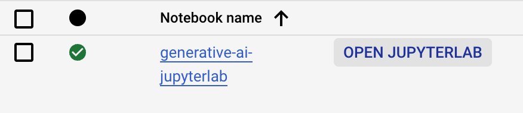
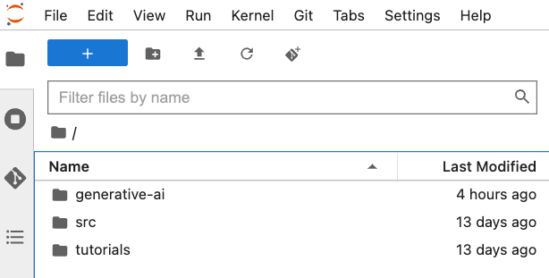
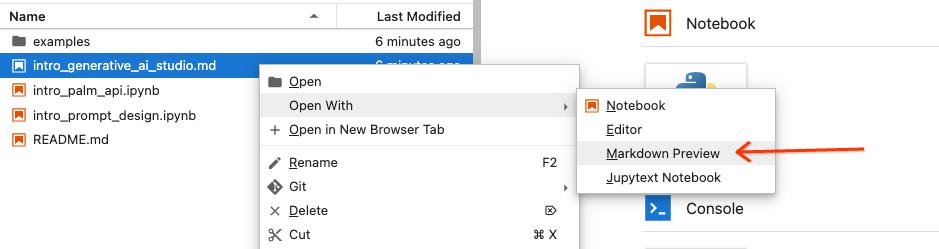

# Generative AI Explorer - Vertex AI

* Overview
    1. Task 1. Vertex AI Workbench
    2. Task 2. Open the generative-ai folder
    3. Task 3. Open the intro notebook
    4. Task 4. Open the intro PaLM API notebook

* PaLM 2 is Google's next generation Large Language Model (LLM) that builds on Google's legacy of breakthrough research in ML and responsible AI. PaLM 2 excels at tasks like advanced reasoning, translation, and code generation because of how it was built.

* Generative AI Studio and the Vertex AI PaLM API is powered by PaLM 2.

* Learn how to get started with Generative AI Studio and the Vertex AI PaLM API.

* What you will learn:
    1. How to use the Generative AI Studio UI:
        1. Explore language offerings and Prompt Gallery
        2. Creating different types of new prompts and getting responses in the UI
    2. How to use the Vertex AI PaLM API & Python SDK:
        1. Background on LLMs and the PaLM API
        2. Text generation examples
        3. Exploring various model parameters involved in text generation
        4. Chat model examples
        5. Embedding model examples

* File Organization - This lab is organized across two different files:
    1. language/intro_generative_ai_studio.md	 - UI-based tutorial on getting started with Generative AI Studio 
    2. language/intro_palm_api.ipynb - Notebook on getting started with the Vertex AI PaLM API & Python SDK

# Task 1. Vertex AI Workbench
* 
* 
* Navigate Vertex AI Workbench -> Open JupyterLab

* 
# Task 2. Open the generative-ai folder
* generative-ai folder > Language > intro_prompt_design.ipynb file > run each step
* Progress
    1. Be Concise
    2. Be specific, and well-defined
    3. Ask one task at a time
    4. Watch out for hallucinations
    5. Turn generative tasks into classification tasks to reduce output variability
    6. Improve response quality by including examples

# Task 3. Open the intro notebook
* intro_generative_ai_studio.md file > open with Markdown Preview > Follow the instructions

# Task 4. Open the intro PaLM API notebook
* intro_palm_api.ipynb > run each cell > The cells of the notebook utilize the Python SDK for the PaLM API.
