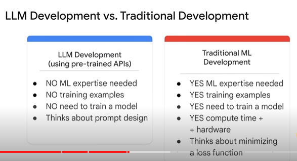

<h1>Introduction to Large Language Models</h1>

* In this course, you learn to define large language models (LLMs), describe LLM use cases, explain prompt tuning.

* <b>Large language models (LLMs)</b>, are a subset of deep learning. LLMs and generative AI intersect and they are both a part of DL.

* <b>Generative AI</b> is a type of AI that can produce new content, including text, images, audio, and synthetic data.

* <b>what are large language models?</b> LLMs refer to large general-purpose language models that can be pre-trained and then fine tuned for specific purposes.

* <b>What do pre-trained and fine tuned mean?</b>
	* 
	* Imagine training a dog. Often, you train your dog basic commands such as sit, come, down, and stay. These commands are normally sufficient for everyday life and help your dog become a good canine citizen.
	
    * 
	* However, if you need a special service dog such as a police dog, a guide dog, or a hunting dog, you add special trainings.
	* The similar idea applies to large language models.
	* These models are trained for general purposes to solve common language problems such as text classification, question answering, document summarization, and text generation across industries.
	* The models can then be tailored to solve specific problems in different fields such as retail, finance, and entertainment using a relatively small size of field data sets.

* <b>3 major features of large language models.</b>
	* <b>Large</b> indicates <b>two meanings</b>.
		* 1.Large (The enormous size of the) training data set (sometimes at the petabyte scale).
		* 2.Large number of parameters
			* In ML, parameters are often called <b>hyperparameters</b>.
			* Parameters are basically the memories and the knowledge that the machine learned from the model training.
			* Parameters define the skill of a model in solving a problem such as predicting text.
	* <b>General purpose</b> means that the models are sufficient to solve common problems. Two reasons lead to this idea.
		* 1.Commonality of a human language regardless of the specific tasks.
		* 2.resource restriction.
		* Only certain organizations have the capability to train such large language models with huge data sets and a tremendous number of parameters.
		* How about letting them create fundamental language models for others to use? This leads to the last point, pre-trained and fine tuned
	* <b>pre-trained and fine tuned</b>, meaning to pre-train a large language model for a general purpose with a large data set and then fine tune it for specific aims with a much smaller data set.

* <b>The benefits of using LLMs</b>
	* 1.a single model can be used for different tasks.
	    * These large language models that are trained with petabytes of data and generate billions of parameters are smart enough to solve different tasks, including language translation, sentence completion, text classification, question answering, and more.
	* 2.LLMs require minimal field training data when you tailor them to solve your specific problem.
		* LLMS obtain decent performance even with little domain training data.
		* In other words, they can be used for <b>few shot or even zero-shot scenarios</b>.
		* In ML, few shot refers to training a model with minimal data, and zero shot implies that a model can recognize things that have not explicitly been taught in the training before.
	* 3.the performance of large language models is continuously growing when you add more data and parameters.

* <b>PaLM (Pathways Language Model)</b>
	* In April 2022, Google released PaLM, a 540 billion-parameter model that achieves a state of the art performance across multiple language tasks.
	* PaLM is a dense decoder-only transformer model.
	* It leverages the new pathways system, which has enabled Google to efficiently train a single model across multiple TPU V4 pods.
	* Pathway is a new AI architecture that will handle many tasks at once, learn new tasks quickly, and reflect a better understanding of the world.
	* The system enables PaLM to orchestrate distributed computation for accelerators.
	* PaLM is a transformer model.
	    * A transformer model consists of encoder and decoder.
	    * The encoder encodes the input sequence and passes it to the decoder, which learns how to decode the representations for a relevant task.
	

* LLM Development vs. Traditional Development. Think about prompt design, which is the process of creating a prompt that is clear, concise, and informative.

* <b>What is Questio Answering in NL processing?</b>
	* Question answering (QA), is a subfield of NL processing that deals with the task of automatically answering questions posed in natural language.
	* QA systems are typically trained on a large amount of text and code.
	* And they are able to answer a wide range of questions, including factual, definitional, and opinion-based questions.
	* The key here is that you need domain knowledge to develop these question-answering models.
	* 
	
* <b>Using generative QA</b> - the model generates free text directly based on the context. There is no need for domain knowledge. Example Bard, chatgpt - <b>This is due to prompt design</b>
	
* <b>What are Prompts and Prompt Engineering?</b>
	* Both are two closely-related concepts in NL processing. 
	* Both involve the process of creating a prompt that is clear, concise, and informative.

* <b>However, there are some key differences between the two.</b>
	* <b>Prompt design</b> is the process of creating a prompt that is tailored to the specific task that this system is being asked to perform.
		* For example, if the system is being asked to translate a text from English to French, the prompt should be written in English and should specify that the translation should be in French.

	* <b>Prompt engineering</b> is the process of creating a prompt that is designed to improve performance. This may involve using domain-specific knowledge

	* Prompt design is a more general concept, while prompt engineering is a more specialized concept.

	* Prompt design is essential, while prompt engineering is only necessary for systems that require a high degree of accuracy or performance.

* <b>3 kinds of large language models</b>
	* <b>generic (raw) language models</b>, 
	* <b>instruction tuned</b>,
	* <b>dialogue tuned</b>.
	* Each needs prompting in a different way.
	
    * 
	* <b>Generic language models</b> predict the next word based on the language in the training data.
		* In this example, "the cat sat on," the next word should be "the." The next word is a token based on the language in the training data.
		* Think of this type as an autocomplete in search.
	
    * 
	* <b>Instruction tuned model</b> is trained to predict a response to the instructions given in the input.
		* For example, summarize a text of X, generate a poem in the style of X, give me a list of keywords based on semantic similarity for X.
		* 
		* And in this example, classify the text into neutral, negative, or positive.
	
    * 
	* <b>Dialogue tuned model</b> is trained to have a dialogue by the next response. 
		* Dialogue-tuned models are a special case of instruction tuned where requests are typically framed as questions to a chat bot.
		* Dialogue tuning is expected to be in the context of a longer back and forth conversation, and typically works better with natural question-like phrasings.

* <b>Chain of Thought Reasoning</b> is the observation that models are better at getting the right answer when they first output text that explains the reason for the answer.
	* For example, first question is posed initially with no response.
	* The model is less likely to get the correct answer directly.
	* However, by the time the second question is asked, the output is more likely to end with the correct answer.
	
* <b>Vertex AI</b> provides task-specific foundation models.
	* Use case where you need to gather sentiments, or how your customers are feeling about your product or service. You can use the classification task - sentiment analysis task model.

* <b>Tuning</b> a model enables you to customize the model response based on examples of the task that you want the model to perform.
	the process of adapting a model to a new domain, or set of custom use cases, by training the model on new data.
	* For example, collect training data and tune the model specifically for the legal or medical domain.

* <b>fine tuning</b> - bring your own data set and retrain the model by tuning every weight in the LLM. This requires a big training job and hosting your own fine-tuned model.
	* an example of a medical foundation model trained on health care data. The tasks include question answering, image analysis, finding similar patients, and so forth.
	* Fine tuning is expensive and not realistic in many cases.

* <b>More efficient methods of tuning</b>
	* <b>Parameter-efficient tuning methods (PETM) </b>, are methods for tuning a large language model on your own custom data without duplicating the model. The base model itself is not altered. Instead, a small number of add-on layers are tuned, which can be swapped in and out at inference time.
	

Quiz

1. What are some of the challenges of using LLMs? Select three options.
	* [x] They can be used to generate harmful content.
	* [x] They can be biased.
	* [ ] After being developed, they only change when they are fed new data.
	* [x] They can be expensive to train.

2. What are some of the benefits of using large language models (LLMs)?
	* [ ] LLMs have a number of benefits, including: They can generate human-quality text. They can be used for many tasks, such as text summarization and code generation.  They can be trained on massive datasets of text, images, and code. They are constantly improving.
	* [ ] LLMs have many benefits, including: They can generate discrete classes and human-quality text. They can be used for many tasks, such as text summarization and code generation. They can be trained on massive datasets of text and code. They are constantly improving.
	* [x] LLMs have many benefits, including: They can generate human-quality text. They can be used for a variety of tasks. They can be trained on massive datasets of text and code. They are constantly improved.
	* [ ] LLMs have many benefits, including: They can generate probabilities and human-quality text. They can be used for many tasks, such as text summarization and code generation. They can be trained on massive datasets of text and code. They are constantly being improved.
    * [ ] LLMs have a number of benefits, including: They can generate non-probabilities and human-quality text. They can be used for many tasks, such as text summarization and code generation. They can be trained on massive datasets of text, image, and code. They are constantly improving.

3. What are some of the applications of LLMs?
	* [ ] LLMs can be used for many tasks, including: Writing, Translating, Coding, Answering questions, Summarizing text, Generating non-creative discrete classes
	* [x] LLMs can be used for many tasks, including: Writing, Translating, Coding, Answering questions, Summarizing text, Generating creative content
	* [ ] LLMs can be used for many tasks, including: Writing, Translating, Coding, Answering questions, Summarizing text, Generating non-creative discrete predictions
	* [ ] LLMs can be used for many tasks, including: Writing, Translating, Coding, Answering questions, Summarizing text, Generating non-creative discrete probabilities
	* [ ] LLMs can be used for many tasks, including: Writing, Translating, Coding, Answering questions, Summarizing text, Generating non-creative discrete probabilities, classes, and predictions.

4. What are large language models (LLMs)?:
	* [ ] Generative AI is a type of artificial intelligence (AI) that can create new content, such as discrete numbers, classes, and probabilities. It does this by learning from existing data and then using that knowledge to generate new and unique outputs.
	* [ ] Generative AI is a type of artificial intelligence (AI) that only can create new content, such as text, images, audio, and video by learning from new data and then using that knowledge to predict a discrete, supervised learning output.
	* [x] An LLM is a type of artificial intelligence (AI) that can generate human-quality text. LLMs are trained on massive datasets of text and code, and they can be used for many tasks, such as writing, translating, and coding.
	* [ ] Generative AI is a type of artificial intelligence (AI) that only can create new content, such as text, images, audio, and video by learning from new data and then using that knowledge to predict a classification output.
	