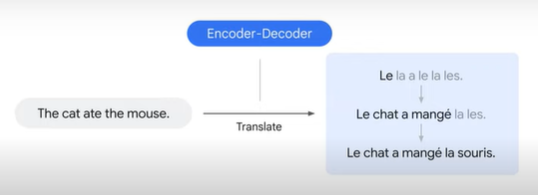
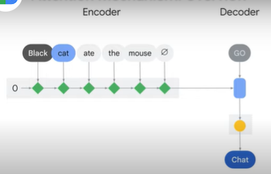
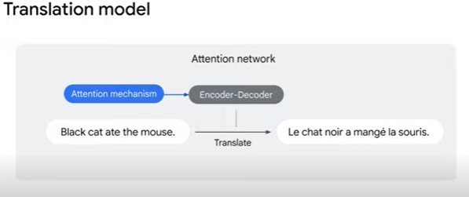
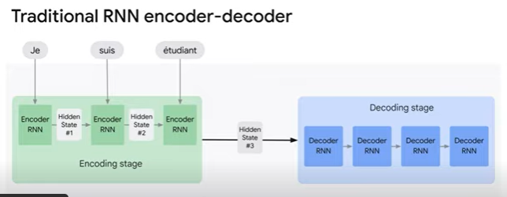
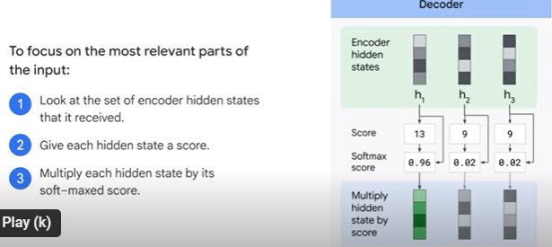
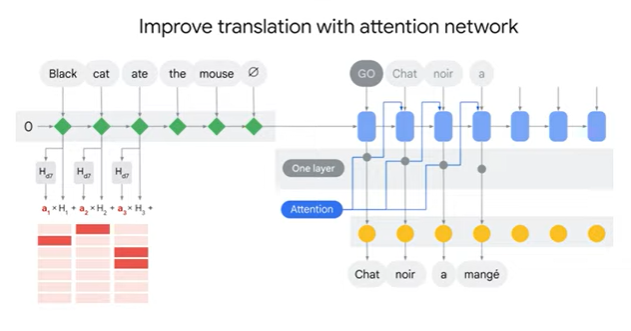
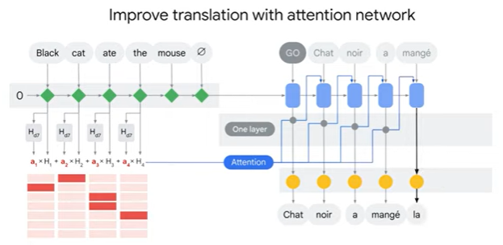

<h1>Attention Mechanism: Overview</h1>

* Want to translate in English sentence "the cat ate the mouse" to French.
	* use an encoder decoder. This is a popular model that is used to translate sentences.
	
	
	* The encoder decoder takes one word at a time and translates it at each time step.
	
	
	* However, sometimes the words in the source language do not align with the words in the target language.
		* Here's an example. Take the sentence "Black cat ate the mouse". 
		* the first English word is black. However, in the translation, the first French word is chat, which means cat in English.
	

* how can you train a model to focus more on the word cat instead of the word black?
	* to improve the translation. You can add the attention mechanism to the encoder decoder.

* <b>Attention mechanism</b> is a technique that allows the NN to focus on specific parts of an input sequence.
	* This is done by assigning weights to different parts of the input sequence with the most important parts receiving the highest weights.

* a <b>traditional RNN based encoder decoder</b> looks like.
	* The model takes one word at a time as input updates the hidden state and passes it on to the next time step.
	* In the end, only the final hidden state is passed on to the decoder.
	* The decoder works with the final hidden state for processing and translates it to the target language.

* An attention model differs from the traditional sequence to sequence model in two ways.
	* 1.the encoder passes a lot more data to the decoder. 
		* So instead of just passing the final hidden state number three to the decoder, the encoder passes all the hidden states from each time step. 
		* This gives the decoder more context beyond just the final hidden state.
		* The decoder uses all the hidden state information to translate the sentence.

	
	* 2.extra step to the attention decoder before producing its output.
		* steps are to focus only on the most relevant parts of the input.The decoder does the following.
		* 1.looks at the set of encoder states that it has received. Each encoder Hidden State is associated with a certain word in the input sentence.
		* 2.it gives each hidden state a score.
		* 3.multiplies each hidden state by its soft-max score as shown here. Thus amplifying hidden states with the highest scores and downsizing hidden states with low scores.

* If we connect all of these pieces together, we're going to see how the Attention Network works.
	* a represents the attention rate at each time step.
	* H represents the hidden state of the encoder RNN at each time step 
	* h subscript B represents the hidden state of the decoder RNN at each time step.

* With the attention mechanism the inversion of the Black Cat translation is clearly visible in the attention diagram and ate translates as two words, "a mange", in French.
	* During the attention step we use the encoder hidden states and the H4 vector to calculate a context vector a four for this time step. 
	* This is the weighted sum. (red lines below a h)
	* We then concatenate H4 and a 4 into one vector.
	* This concatenated vector is passed through a feedforward neural network.
	* One train jointly with the model to predict the next work.
	* The output of the feedforward neural network indicates the output word of this time step.
	* This process continues till the end of sentence token is generated by the decoder.
	* This is how you can use an attention mechanism to improve the performance of a traditional encoder decoder architecture.
