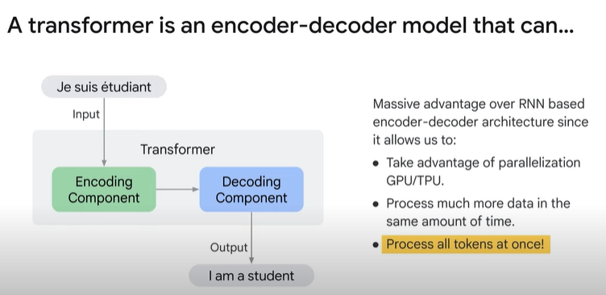
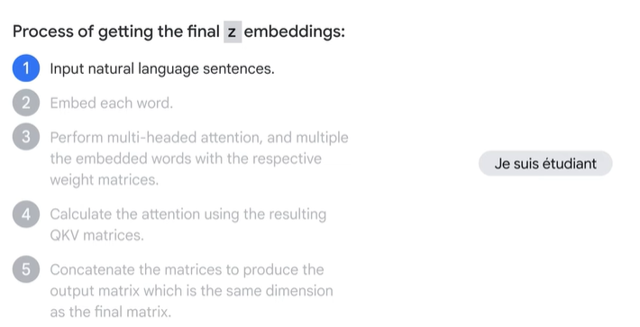
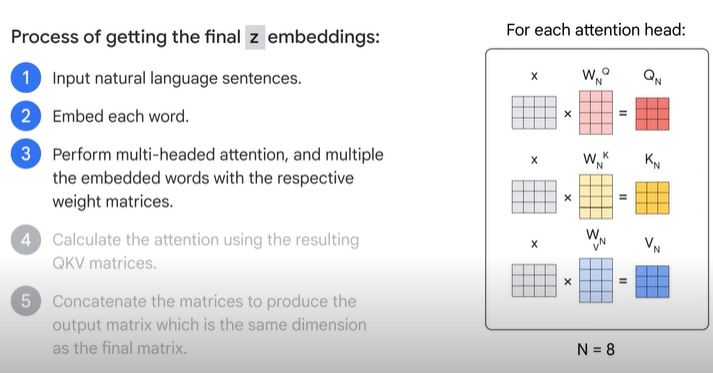

<h1>Transformer Models and BERT Model: Overview</h1>

* <b>Transformer Models</b>
	* A transformer is an encoder decoder model that uses the attention mechanism. 
	* Attention mechanism helps improve the performance of machine translation applications. 
	* Transformer models were built using attention mechanisms at the core. 

* A transformer model consists of <b>encoder and decoder</b>.
* The encoder encodes the input sequence and passes it to the decoder and the decoder decodes the representation for a relevant task. 

* Each encoder can be broken down into two sub layers. 
	* 1.<b>self attention.</b> The input of the encode are first flows through a self attention layer, which helps to encode or look at relevant parts of the words as it encodes a central word in the input sentence. 
	* 2.<b>feedforward layer.</b> The output of the self attention layer is fed to the feedforward neural network. 

* <b>The decoder has both the self attention and the feedforward layer</b>, but between them is the encoder decoder, attention layer that helps a decoder focus on relevant parts of the input sentence. 
	

* The word at each position passes through a self attention process. Then it passes through a feedforward neural network, the exact same network with each vector flowing through it separately. 

* In the self attention layer, the input embedding is broken up into <b>query, key, and value vectors</b>.
* These vectors are computed using weights that the transformer learns during the training process. 

* All of these computations happen in parallel in the model, in the form of matrix computation.

* Once we have the query key and value vectors, the next step is to multiply each value vector by the soft max score in preparation to sum them up.

* Next, we have to sum up the weighted value vectors which produces the output of the self attention layer at this position. For the first word, you can send along the resulting vector to the feedforward neural network. 

* <b>To sum up this process</b> of getting the final embeddings, these are the steps that we take. 
	* , 
	* 
	* We start with the natural language sentence embed each word in the sentence. 
	* 
	* After that, we perform multi-headed attention eight times in this case and multiply this embedded word with the respective weighted matrices. 
	* 
	* We then calculate the attention using the resulting Q K.V. matrices. 
	* 
	* Finally, we can concatenate the matrices to produce the output matrix, which is the same dimension as the final matrix that this layer initially got. 

* There's multiple variations of transformers out there now. 
	* Some use both the encoder and the decoder component from the original architecture.
	* Some use only the encoder and some use only the decoder. 
	* A popular encoder only architecture is Bert.

* <b>BERT (bidirectional encoder representations from transformers) Model</b>

* The way that Bert works is that it was trained on two different tasks. 
	
	* 1.<b>a masked language model</b>, where the sentences are masked and the model is trained to predict the masked words.
		* If you were to train Bert from scratch, you would have to mask a certain percentage of the words in your corpus. The recommended percentage for masking is 15%. 
		* The masking percentage achieves a balance between too little and too much masking. 
		* Too little masking makes the training process extremely expensive, and 
		* too much masking removes the context of the model requires. 
	
	* 2.<b>to predict the next sentence</b>.
		* For example, the model is given two sets of sentences. Bert aims to learn the relationships between sentences and predict the next sentence given the first one. 
		* For example, sentence A could be a man went to the store and sentence B is he bought a gallon of milk. 
		* Bert is responsible for classifying if sentence B is in next sentence after sentence A. This is a binary classification task. This helps Bert perform at a sentence level in order to train Bert. 

* Need to feed three different kinds of embeddings to the model for the input sentence: <b>token, segment and position embeddings</b>. 
	* <b>The token embeddings</b> is a representation of each token as an embedding in the input sentence.
		* The words are transformed into vector representations of certain dimensions.
		* Bert can solve NLP tasks that involve tex classification as well. 
			* An example is to classify whether two sentences say my dog is cute and he likes playing are semantically similar.
			* The pairs of input texts are simply concatenated and fed into the model. 
	* How does Bert distinguish the input in a given pair? The answer is to use segment embeddings.
		* There is a special token represented by SEP that separates the two different splits of the sentence. 
	* Another problem is to learn the order of the words in the sentence.
		* As you know, Bert consists of a stack of transformers. Bert is designed to process input sequences up to a length of 512. 
		* The order of the input sequence is incorporated into the position embeddings.
		* This allows Bert to learn a vector representation for each position. 

* Bert can be used for different downstream tasks. Although Bert was trained on mass language modeling and single sentence classification, it can be used for popular NLP tasks like single sentence classification. Sentence Pair Classification. Question Answering and single sentence tagging tasks. 

<b>Summary</b>

* The transformer model, uses attention mechanisms to capture the context and dependencies between words in a text. It consists of an encoder and a decoder. The encoder encodes the input sequence using self-attention and a feedforward layer. The decoder also employs self-attention and a feedforward layer, with an additional encoder-decoder attention layer to focus on relevant parts of the input sentence.

* the process of self-attention, where input embeddings are divided into query, key, and value vectors, which are then multiplied and summed to obtain the output of the self-attention layer. The transformer model performs multi-headed attention multiple times, and the resulting matrices are concatenated to produce the final output.

* The BERT model, is a powerful variant of the transformer model and was trained on tasks such as masked language modeling and next sentence prediction. It can handle long input context and performs well at both the sentence and token level.

* To train BERT, three types of embeddings are used: token embeddings, segment embeddings, and position embeddings. Token embeddings represent each token in the input sentence, segment embeddings distinguish different splits of the sentence, and position embeddings capture the order of the words.

* BERT can be applied to various NLP tasks, including text classification, sentence pair classification, question answering, and single sentence tagging.

Quiz
1. What are the three different embeddings that are generated from an input sentence in a Transformer model? 
	* [ ] Embedding, classification, and next sentence embeddings
	* [ ] Recurrent, feedforward, and attention embeddings
	* [ ] Convolution, pooling, and recurrent embeddings
	* [x] Token, segment, and position embeddings

2. BERT is a transformer model that was developed by Google in 2018. What is BERT used for?
	* [ ] It is used to generate text, translate languages, and write different kinds of creative content.
	* [ ] It is used to diagnose and treat diseases.
	* [ ] It is used to train other machine learning models, such as Recurrent Neural Networks (RNNs) and Long Short-Term Memory (LSTM) networks.
	* [X] It is used to solve many natural language processing tasks, such as question answering, text classification, and natural language inference.
	
3. What does fine-tuning a BERT model mean?
	* [ ] Training the model on a specific task by using a large amount of unlabeled data
	* [ ] Training the model on a specific task and not updating the pre-trained weights
	* [ ] Training the hyper-parameters of the models on a specific task
	* [x ] Training the model and updating the pre-trained weights on a specific task by using labeled data

4. What are the encoder and decoder components of a transformer model?
	* [ ] The encoder ingests an input sequence and produces a single hidden state. The decoder takes in the hidden state from the encoder and produces an output sequence.
	* [ ] The encoder ingests an input sequence and produces a sequence of images. The decoder takes in the images from the encoder and produces an output sequence.
	* [ ] The encoder ingests an input sequence and produces a sequence of tokens. The decoder takes in the tokens from the encoder and produces an output sequence.
	* [x] The encoder ingests an input sequence and produces a sequence of hidden states. The decoder takes in the hidden states from the encoder and produces an output sequence.

5. What are the two sublayers of each encoder in a Transformer model?
	* [ ] Embedding and classification
	* [ ] Recurrent and feedforward
	* [ ] Convolution and pooling
	* [x] Self-attention and feedforward

6. What is the name of the language modeling technique that is used in Bidirectional Encoder Representations from Transformers (BERT)?
	* [ ] Recurrent Neural Network (RNN)
	* [ ] Gated Recurrent Unit (GRU)
	* [ ] Long Short-Term Memory (LSTM)
	* [x] Transformer
	
7. What kind of transformer model is BERT?
	* [x] Encoder-only model
	* [ ] Recurrent Neural Network (RNN) encoder-decoder model
	* [ ] Decoder-only model
	* [ ] Encoder-decoder model

8. What is a transformer model?
	* [ ] A machine learning model that uses recurrent neural networks to learn relationships between different parts of a sequence.
	* [ ] A computer vision model that uses fully connected layers to learn relationships between different parts of an image.
	* [ ] A natural language processing model that uses convolutions to learn relationships between different parts of a sequence.
	* [x] A deep learning model that uses self-attention to learn relationships between different parts of a sequence.

9. What is the attention mechanism?
	* [ ] A way of determining the similarity between two sentences
	* [ ] A way of identifying the topic of a sentence
	* [ ] A way of predicting the next word in a sentence
	* [x] A way of determining the importance of each word in a sentence for the translation of another sentence
