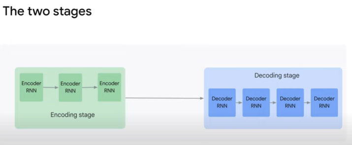
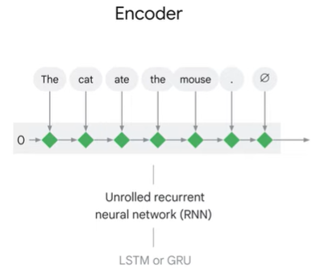

<h1>Encoder-Decoder Architecture: Overview</h1>

* the encoder-decoder architecture, which is fundamental to large language models. 

* The encoder-decoder architecture is a sequence-to-sequence model that takes an input sequence, such as a sentence in English, and produces an output sequence, such as the translation of that sentence in French.

* The encoder-decoder architecture consists of two stages: the encoder stage and the decoder stage.

* an encoder stage that produces a vector representation of the input sentence. Then this encoder stage is followed by a decoder stage that creates the sequence output . 

* Both the encoder and the decoder can be implemented with different internal architectures.
	* 
	 * A recurrent neural network encoder takes each token of the input sequence and produces a state representing that token and the previously processed tokens. This state is then used in the next encoding step along with the next token to poduce the next state. Once all the input tokens are processed, the encoder outputs a vector representing the full input sentence.

	* 
	* The decoder takes the vector representation of the input sentence and generates an output sentence from it. In the case of a recurrent NN (RNN) decoder, it decodes the output one token at a time, using the current state and the previously generated tokens.
	

* Training the encoder-decoder architecture requires a dataset of input/output pairs that the model should imitate. For example, in the case of translation, the dataset would consist of sentence pairs in the source and target languages. During training, the encoder processes the source language sentence, and the decoder is trained to generate the correct translation given the previous translated tokens as input (teacher forcing).

* in your code you’ll have to prepare two input sentences, the original one fed to the encoder, and also the original one shifted to the left that you’ll feed to the decoder. 

* Another subtle point is that the decoder generates at each step only the probability that each token in your vocabulary is the next one. Using these probabilities, you’ll have to select a word.

* And there are several approaches for that. The simplest one, called greedy search, is to generate the token that has the highest probability. 

* A better approach that produces better results is called beam search.

* At serving time, when generating new translations or responses to prompts, the encoder representation of the prompt is fed to the decoder along with a special token like "GO" to initiate the generation process. 

* The decoder updates its state based on the encoder's representation and generates word probabilities using a dense softmax layer. 

* The highest probability token (or chunk, in the case of beam search) is selected as the generated word. This process is repeated until the desired sequence is generated.

* In large language models, such as those based on the Transformer architecture, the encoder and decoder blocks differ from the simple RNN-based architecture. Transformer blocks, based on the attention mechanism, are used instead. 

Quiz

1. What is the difference between greedy search and beam search?
	* [ ] Greedy search considers multiple possible words and selects the one with the highest combined probability, whereas beam search always selects the word with the highest probability.
	* [ ] Greedy search always selects the word with the lowest probability, whereas beam search considers multiple possible words and selects the one with the lowest combined probability.
	* [ ] Greedy search considers multiple possible words and selects the one with the lowest combined probability, whereas beam search always selects the word with the lowest probability.
	* [x] Greedy search always selects the word with the highest probability, whereas beam search considers multiple possible words and selects the one with the highest combined probability.

2. What is the name of the machine learning architecture that takes a sequence of words as input and outputs a sequence of words?
	* [ ] Large stream text manipulation
	* [ ] Regressive neural networking
	* [ ] Collaborative natural network
	* [x] Encoder-decoder

3. What are two ways to generate text from a trained encoder-decoder model at serving time?
	* [ ] Greedy search and attention
	* [ ] Teacher forcing and beam search
	* [ ] Teacher forcing and attention
	* [x] Greedy search and beam search

4. What is the purpose of the decoder in an encoder-decoder architecture?
Note: To get credit for a multiple-select question, you must select all of the correct options and none of the incorrect ones.
	* [ ] To learn the relationship between the input and output sequences
	* [x] To generate the output sequence from the vector representation
	* [x] To predict the next word in the output sequence
	* [ ] To convert the input sequence into a vector representation

5. What is the purpose of the encoder in an encoder-decoder architecture?
	* [ ] To learn the relationship between the input and output sequences
	* [ ] To generate the output sequence from the vector representation
	* [ ] To predict the next word in the output sequence
	* [x] To convert the input sequence into a vector representation